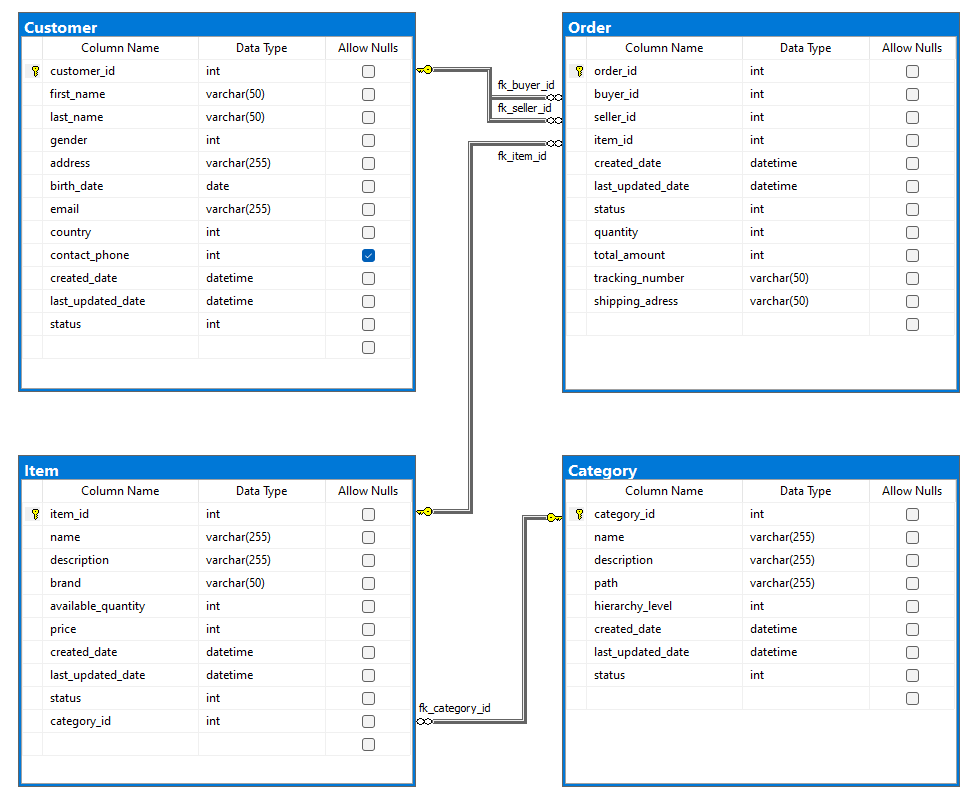

# SQL - Mercado Libre Challenge
This repository contains SQL scripts to address specific questions outlined in the Mercado Libre Challenge.

## Entity Relationship Diagram (ERD) 

## Questions
The SQL scripts provided aim to solve the following questions:

1. **Question 1:** List users whose birthdays are today and had more than 1500 sales in January 2020.
- [Question 1 resolution](https://github.com/AugustoCarloPareja/meli_etl_challenge/blob/master/SQL/respuestas_negocio.sql#L1-L17)
2. **Question 2:** For each month of 2020, provide the top 5 users who sold the most in the 'Celulares' category. Include analysis month and year, seller's first and last name, number of sales, number of products sold, and total transaction amount.
- [Question 2 resolution](https://github.com/AugustoCarloPareja/meli_etl_challenge/blob/master/SQL/respuestas_negocio.sql#L18-L51)
3. **Question 3:** Populate a new table with the price and status of items at the end of each day. Ensure the process is reproducible. Note that the Item table contains only the latest reported state per defined primary key.
- [Question 3 resolution](https://github.com/AugustoCarloPareja/meli_etl_challenge/blob/master/SQL/respuestas_negocio.sql#L52-L71)